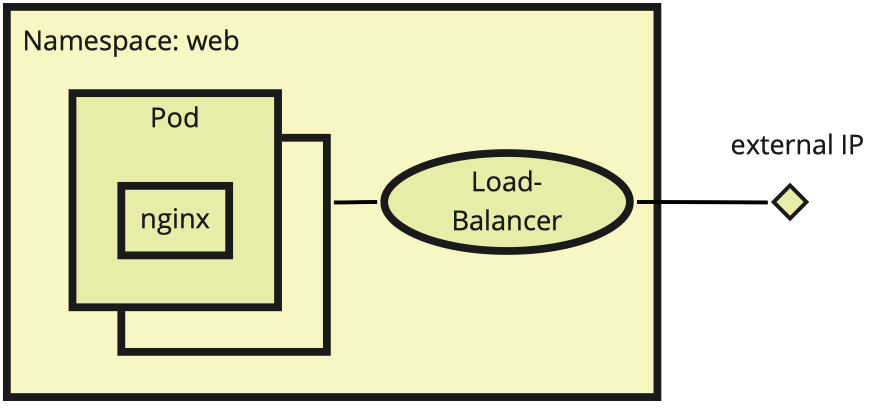
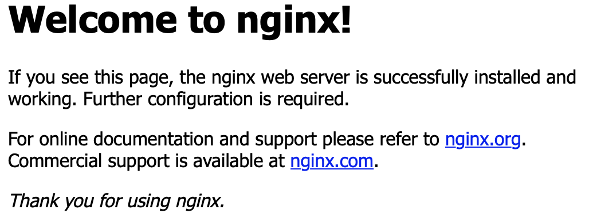

# Preface

Kubernetes has already become a common technology for everyone who has the challenge to ship and run any applications in the cloud. And every cloud provider give us tools like an api, to setup the infrastructure as easy as possible for us, DevOps engineers.
We just start a kubernetes service, wait a couple of seconds and et voilà! It has an external IP, which we can assign a domain to access the endpoint as if no magic happened. Have you tried the same in your local network? If the answer is no, give it a try. Just to understand that not everything a cloud provider does for you can be taken for granted. Let us use a simple example to show you the challenges you face and how you can master them.

We are not going to explain how to set up a kubernetes cluster in your local network, but how to deploy a simple nginx in a ready-made cluster and access it by a domain in your local network.

## Software Prerequisites

You need an unmanaged kubernetes cluster running in your local network. We tested this guide with the k8s-version 1.17.2 on one master and two workers.

## Let us fail first

We deploy a simple nginx deployment with two replicas and a load balancer:



nginx-server.yaml

```yaml
apiVersion: v1
kind: Namespace
metadata:
  name: web

---

apiVersion: v1
kind: Service
metadata:
  name: nginx
  namespace: web
spec:
  ports:
  - port: 80
    targetPort: 80
  type: LoadBalancer
  selector:
    app: nginx

---

apiVersion: apps/v1
kind: Deployment
metadata:
  name: nginx
  namespace: web
spec:
  replicas: 2
  selector:
    matchLabels:
      app: nginx
  template:
    metadata:
      labels:
        app: nginx
    spec:
      containers:
      - name: website
        image: nginx
        ports:
          - containerPort: 80
```

Now we are going to create this deployment by executing `kubectl`:

```sh
kubectl create -f nginx-server.yaml
```

On a managed cluster you would expect the load balancer to obtain an external IP address from the cloud provider. This will not happen in an unmanaged cluster in your local network. It remains `pending`:

```sh
NAME    TYPE           CLUSTER-IP    EXTERNAL-IP   PORT(S)        AGE
nginx   LoadBalancer   10.96.34.70   <pending>     80:32593/TCP   5m15s
```

What now? You can still access the service by forwarding the port to localhost:

```sh
  kubectl port-forward -n web service/nginx 8080:80
```

You can visit the website at `http://localhost:8080` now. But only you, not your colleagues in the office.
This approach is not what we want. Our load balancer need an ip address in our local network.

## Be like a cloud provider

What we need is a DHCP server and the installed MetalLB infrastructure (<https://metallb.universe.tf)>.Since MetalLB runs in a dedicated namespace, we create namespace `metallb-system`:

```sh
kubectl create namespace metallb-system
```

...and deploy MetalLB in our cluster:

```sh
kubectl create secret generic -n metallb-system memberlist --from-literal=secretkey="$(openssl rand -base64 128)"
kubectl apply -f https://raw.githubusercontent.com/google/metallb/v0.9.3/manifests/metallb.yaml
```

Let's take a look at the pods and make sure they are running:

```sh
kubectl get pod -n metallb-system

NAME                              READY   STATUS    RESTARTS   AGE
pod/controller-5696cd5dcb-9hjss   1/1     Running   0          75s
pod/speaker-56rsl                 1/1     Running   0          75s
pod/speaker-5ctv5                 1/1     Running   0          75s
```

If so, we are ready to configure our cluster for the allocation of static ip addresses by load balancers.

## Configure MetalLB

MetalLB supports two configurations of announcing service ip addresses: Layer2 and BGP. We used Layer2 Configuration because it's easy and works well in most network landscapes (see more information at <https://metallb.universe.tf/configuration)>.
Let's assume you want to visit your website at `http://192.168.1.100`. For that case we create the following ConfigMap and put this ip address in `addresses` as a range:

```yaml
apiVersion: v1
kind: ConfigMap
metadata:
  namespace: metallb-system
  name: config
data:
  config: |
    address-pools:
    - name: default
      protocol: layer2
      addresses:
      - 192.168.1.100-192.168.1.100
```

Of course, you can put a range of ip addresses here, but we want to keep it simple and unambiguous now.

After deploying this YAML with `kubectl create -f metallb-config.yaml`, the load balancer is able to obtain an ip address within our local network:

```sh
NAME                         TYPE           CLUSTER-IP    EXTERNAL-IP     PORT(S)        AGE
service/nginx                LoadBalancer   10.96.34.70   192.168.1.100   80:32593/TCP   57m
```

Now you should be able to visit the website at `http://192.168.1.100`:



## DNS record

Since the website has a static IP address, it is possible to create an A-record on the DNS server, let say `nginx.your-domain.lan -> 192.168.1.100`, and access the website in web browser under `http://nginx.your-domain.lan`.

That is what you wanted, didn't you?

## Cleaning up

If you are ready and don't want to use the nginx server and MetalLB, you can remove the deployments with `kubectl` again:

```sh
kubectl delete namespace metallb-system
kubectl delete namespace web
```
